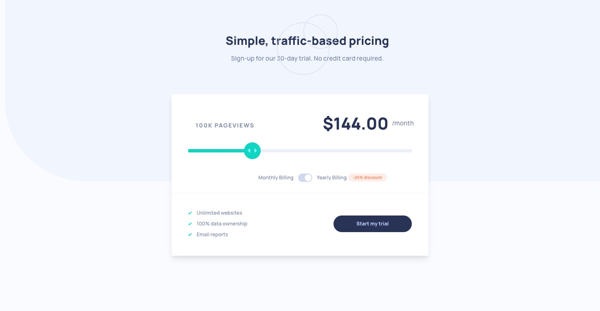

# Frontend Mentor - Interactive pricing component solution

This is a solution to the [Interactive pricing component challenge on Frontend Mentor](https://www.frontendmentor.io/challenges/interactive-pricing-component-t0m8PIyY8). Frontend Mentor challenges help you improve your coding skills by building realistic projects. 

## Table of contents

- [Overview](#overview)
  - [The challenge](#the-challenge)
  - [Screenshot](#screenshot)
  - [Links](#links)
- [My process](#my-process)
  - [Built with](#built-with)
- [Author](#author)
- [Acknowledgments](#acknowledgments)

## Overview

### The challenge

Users should be able to:

- View the optimal layout for the app depending on their device's screen size
- See hover states for all interactive elements on the page
- Use the slider and toggle to see prices for different page view numbers

### Screenshot

 
 

### Links

- Solution URL: [github.com/Zacharycampanelli/Interactive-Pricing-Component](https://https://github.com/Zacharycampanelli/Interactive-Pricing-Component)

- Live Site URL: [campanelli-pricing-component.netlify.app/](https://campanelli-pricing-component.netlify.app/)

## My process

### Built with

- Flexbox
- Chakra UI
- Mobile-first workflow
- JavaScript
- React
- REST API
- SVGR
- Netlify
- React-Responsive API

## Author

- GitHub: [Zacharycampanelli](https://github.com/Zacharycampanelli)  
- Frontend Mentor - [@Zacharycampanelli](https://www.frontendmentor.io/profile/Zacharycampanelli)
- Email: [zaccamp@optonline.net](mailto:zaccamp@optonline.net)

## Acknowledgments

- [Frontend Mentor](https://www.frontendmentor.io)

